# 🛡️ SYN Flood Detection using Finite Deterministic Automata

A Python-based network security tool that uses **Finite Deterministic Automata (DFA)** to detect SYN flooding attacks in real-time. This project demonstrates how formal computational models can be applied to cybersecurity for pattern recognition and anomaly detection.

## 📋 Table of Contents

- [Overview](#overview)
- [Finite Deterministic Automata in Network Security](#finite-deterministic-automata-in-network-security)
- [Features](#features)
- [Installation](#installation)
- [Usage](#usage)
- [How It Works](#how-it-works)
- [TCP State Machine](#tcp-state-machine)
- [Detection Algorithm](#detection-algorithm)
- [Examples](#examples)
- [Configuration](#configuration)
- [Contributing](#contributing)
- [Legal Disclaimer](#legal-disclaimer)

## 🎯 Overview

This project implements a SYN flood detection system that monitors network traffic and identifies potential DDoS attacks using:

1. **Real-time packet analysis** with Scapy
2. **Finite Deterministic Automata** to model TCP connection states
3. **Statistical analysis** to detect anomalous traffic patterns
4. **Multi-threaded architecture** for efficient processing

## 🤖 Finite Deterministic Automata in Network Security

### What is a Finite Deterministic Automaton?

A **Finite Deterministic Automaton (DFA)** is a computational model consisting of:
- A finite set of **states**
- A finite **alphabet** (input symbols)
- A **transition function** that maps state-symbol pairs to new states
- An **initial state**
- A set of **accepting states**

### Application to Network Attack Detection

In network security, DFAs can be used to:

1. **Model Protocol Behavior**: TCP connections follow predictable state transitions
2. **Detect Anomalies**: Deviations from normal protocol behavior indicate attacks
3. **Pattern Recognition**: Identify specific attack signatures
4. **Real-time Processing**: Efficient state-based processing for high-speed networks

### TCP Connection State Machine

Our implementation models TCP connections using the following simplified state flow:


**Key States for SYN Flood Detection:**
- **CLOSED**: No connection - starting point
- **SYN_RECEIVED**: Server got SYN, waiting for ACK (⚠️ vulnerable state)
- **ESTABLISHED**: Normal connection active
- **FIN_WAIT_1 / TIME_WAIT**: Connection closing phases

### SYN Flood Detection Logic

The automaton detects SYN floods by:

1. **Tracking Connection States**: Each TCP connection is modeled as a state machine
2. **Counting Incomplete Handshakes**: SYN packets without corresponding SYN-ACK/ACK
3. **Time Window Analysis**: Measuring SYN packet frequency within sliding windows
4. **Threshold-based Alerting**: Triggering alerts when SYN counts exceed thresholds

```mermaid
flowchart LR
    A[📦 Capture Packet] --> B{SYN?}
    B -->|Yes| C[📊 Count SYNs]
    B -->|No| D[🔄 Update State]
    C --> E{Count > Threshold?}
    E -->|Yes| F[🚨 ALERT!]
    E -->|No| D
    F --> G[📝 Log Attack]
    D --> A
    G --> A
    
    style A fill:#4ecdc4
    style C fill:#ffe66d
    style F fill:#ff6b6b
    style G fill:#ffb3ba
```



## ✨ Features

- 🔍 **Real-time SYN flood detection**
- 🤖 **Finite automata-based TCP state modeling**
- 📊 **Statistical analysis and reporting**
- 🚨 **Configurable alerting system**
- 🧵 **Multi-threaded packet processing**
- 📈 **Performance monitoring and statistics**
- 🛠️ **Command-line interface with multiple options**
- 🌐 **Network interface auto-detection**

## 🚀 Installation

### Prerequisites

- Python 3.7+
- Administrator/root privileges (for packet capture)
- Network interface with traffic to monitor

### Install Dependencies

```bash
# Install required packages
pip install scapy

# For Linux users (if needed)
sudo apt-get install python3-scapy

# For Windows users, you might need:
# - Npcap or WinPcap
# - Visual C++ Build Tools
```

### Clone Repository

```bash
git clone https://github.com/yourusername/synflood-detect.git
cd synflood-detect
```

## 💻 Usage

### 1. SYN Flood Detection (Monitor Mode)

```bash
# Basic detection with default settings
sudo python3 SYN_Detect.py

# Specify network interface
sudo python3 SYN_Detect.py --interface eth0

# Custom thresholds and timing
sudo python3 SYN_Detect.py --syn-threshold 50 --time-window 5 --verbose

# Monitor specific target
sudo python3 SYN_Detect.py --target-ip 192.168.1.100
```

### 2. SYN Flood Emulation (Testing Mode)

```bash
# Generate SYN flood for testing
python3 SYN_flood_emulation.py
# Enter target IP: 192.168.1.100
# Enter target port: 80
# Enter number of threads: 10
```

**⚠️ Warning**: Only use the emulation tool on networks you own or have explicit permission to test!

### Command Line Options

```bash
usage: SYN_Detect.py [-h] [--interface INTERFACE] [--syn-threshold SYN_THRESHOLD]
                     [--time-window TIME_WINDOW] [--connection-timeout CONNECTION_TIMEOUT]
                     [--target-ip TARGET_IP] [--target-port TARGET_PORT] [--verbose]

options:
  -h, --help            show this help message and exit
  --interface INTERFACE Network interface to monitor
  --syn-threshold SYN_THRESHOLD
                        SYN packets threshold for alert (default: 100)
  --time-window TIME_WINDOW
                        Time window in seconds for SYN counting (default: 10)
  --connection-timeout CONNECTION_TIMEOUT
                        Connection timeout in seconds (default: 30)
  --target-ip TARGET_IP
                        Specific IP to monitor (optional)
  --target-port TARGET_PORT
                        Specific port to monitor (optional)
  --verbose             Enable verbose output
```

## 🔬 How It Works

### 1. Packet Capture and Analysis

```python
def _packet_handler(self, packet):
    """Process each captured packet through the automaton"""
    if packet.haslayer(TCP) and packet.haslayer(IP):
        self._process_tcp_packet(packet)
```

### 2. TCP State Transitions

```python
tcp_transitions = {
    (TCPState.CLOSED, PacketFlags.SYN): TCPState.SYN_RECEIVED,
    (TCPState.SYN_RECEIVED, PacketFlags.ACK): TCPState.ESTABLISHED,
    (TCPState.ESTABLISHED, PacketFlags.FIN): TCPState.FIN_WAIT_1,
    # ... more transitions
}
```

### 3. SYN Flood Detection Algorithm

```python
def _process_syn_packet(self, src_ip, dst_ip, src_port, dst_port, timestamp):
    """Detect SYN flooding using sliding window approach"""
    # Add SYN to time-based queue
    self.syn_counts[src_ip].append(timestamp)
    
    # Remove old entries (outside time window)
    while (self.syn_counts[src_ip] and 
           timestamp - self.syn_counts[src_ip][0] > self.time_window):
        self.syn_counts[src_ip].popleft()
    
    # Check if threshold exceeded
    if len(self.syn_counts[src_ip]) >= self.syn_threshold:
        self._generate_alert(src_ip, dst_ip, len(self.syn_counts[src_ip]), timestamp)
```

### 4. Alert Generation

The system generates alerts when:
- SYN packet count exceeds threshold within time window
- Connections remain in SYN_RECEIVED state too long
- Unusual patterns in TCP state transitions are detected

## 📊 TCP State Machine

The detector implements a complete TCP state machine:

| State | Description | Transitions |
|-------|-------------|-------------|
| `CLOSED` | Initial state | SYN → SYN_RECEIVED |
| `LISTEN` | Server listening | SYN → SYN_RECEIVED |
| `SYN_SENT` | Client sent SYN | SYN_ACK → ESTABLISHED |
| `SYN_RECEIVED` | Server received SYN | ACK → ESTABLISHED |
| `ESTABLISHED` | Connection active | FIN → FIN_WAIT_1, RST → CLOSED |
| `FIN_WAIT_1` | Closing initiated | ACK → FIN_WAIT_2 |
| `FIN_WAIT_2` | Wait for FIN | FIN → TIME_WAIT |
| `TIME_WAIT` | Connection cleanup | ACK → CLOSED |

## 🔧 Configuration

### Detection Parameters

- **SYN Threshold**: Number of SYN packets to trigger alert (default: 100)
- **Time Window**: Sliding window duration in seconds (default: 10)
- **Connection Timeout**: TCP connection timeout in seconds (default: 30)

### Example Custom Configuration

```python
detector = SYNFloodDetectorFSM(
    interface="eth0",
    syn_threshold=50,      # Lower threshold for testing
    time_window=5,         # 5-second window
    connection_timeout=15, # 15-second timeout
    verbose=True           # Enable detailed logging
)
```

## 📈 Examples

### Example 1: Basic Monitoring

```bash
sudo python3 SYN_Detect.py --verbose
```

Output:
```
🛡️  Detector SYN Flood inicializado
   Interface: Auto-detectar
   Threshold SYN: 100
   Janela de tempo: 10s

🔄 192.168.1.50:12345 -> 192.168.1.100:80 | CLOSED -> SYN_RECEIVED | SYN
🔄 192.168.1.100:80 -> 192.168.1.50:12345 | SYN_RECEIVED -> ESTABLISHED | SYN_ACK
🚨 ALERTA: Possível SYN Flood detectado!
   IP: 10.0.0.50 -> 192.168.1.100
   SYNs: 150 em 10.0s
```

### Example 2: Targeted Monitoring

```bash
sudo python3 SYN_Detect.py --target-ip 192.168.1.100 --target-port 80 --syn-threshold 25
```

This monitors only traffic to IP 192.168.1.100 on port 80 with a lower threshold.

## ⚖️ Legal Disclaimer

This tool is designed for:
- ✅ **Educational purposes**
- ✅ **Authorized security testing**
- ✅ **Network monitoring on owned infrastructure**
- ✅ **Cybersecurity research**

**DO NOT USE** for:
- ❌ Unauthorized network attacks
- ❌ Testing on networks you don't own
- ❌ Any illegal activities

Users are responsible for complying with applicable laws and obtaining proper authorization before using these tools.

## 🤝 Contributing

1. Fork the repository
2. Create a feature branch (`git checkout -b feature/amazing-feature`)
3. Commit your changes (`git commit -m 'Add amazing feature'`)
4. Push to the branch (`git push origin feature/amazing-feature`)
5. Open a Pull Request

## 📚 References

- [RFC 793: Transmission Control Protocol](https://datatracker.ietf.org/doc/html/rfc793)
- [Scapy Documentation](https://scapy.readthedocs.io/)
- [Finite Automata Theory](https://en.wikipedia.org/wiki/Finite_automaton)
- [SYN Flood Attack Prevention](https://tools.ietf.org/html/rfc4987)

## 📄 License

This project is licensed under the MIT License - see the [LICENSE](LICENSE) file for details.

---

**Made with ❤️ for cybersecurity education and research** 